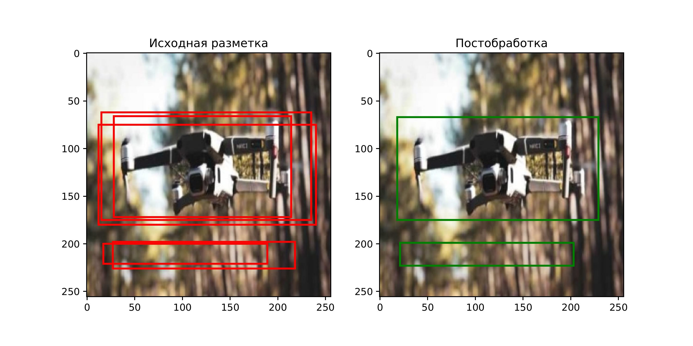
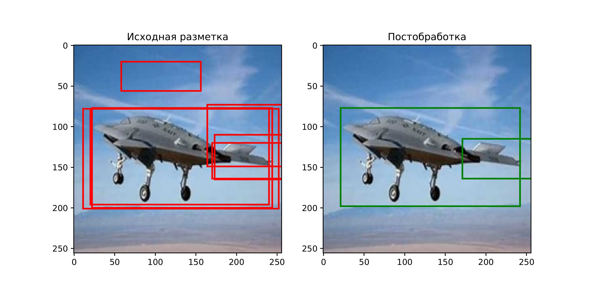
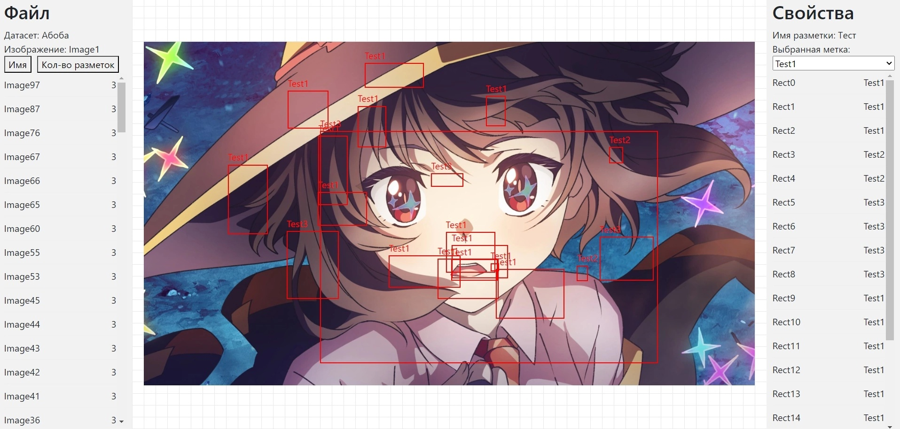

# Название проекта

JustLabel

# Краткое описание идеи проекта

Программа для совместной разметки данных для задач детекции объектов на изображении с возможностью агрегации. Программа позволяет загружать данные с диска, размечать их, просматривать и сохранять результат. Перед началом работы необходимо авторизоваться для сохранения информации о пользователе, который разметил данные. При разметке программа поддерживает работу нескольких пользователей одновременно над одними данными.

# Примеры агрегации разметки

# Пример разметки

# Краткое описание акторов (ролей)

В проекте определены следующие роли:

- Гость -- неавторизованный посетитель.
- Разметчик -- авторизованный пользователь с доступом к инструментам разметки.
- Администратор -- авторизованный пользователь с доступом к инструментам разметки и инструментам администрирования.

# Технологический стек
- Backend: C#
- Frontend: HTML + CSS + JS
- Framework: React
- Database: PostgreSQL / MongoDB
